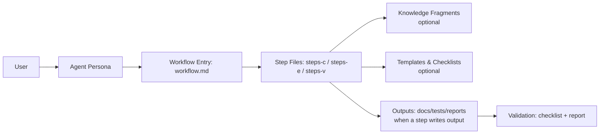

# Test Architect (TEA)

TEA (Test Architect) is a standalone BMAD module that delivers risk-based test strategy, test automation guidance, and release gate decisions. It provides a single expert agent (Murat, Master Test Architect and Quality Advisor) and eight workflows spanning framework setup, test design, ATDD, automation, traceability, NFR assessment, CI guidance, and test review.

## Why TEA

- Risk-based testing with measurable quality gates
- Consistent, knowledge-base driven outputs
- Clear prioritization (P0-P3) and traceability
- Optional Playwright Utils and MCP enhancements

## How BMad Works

BMad works because it turns big, fuzzy work into **repeatable workflows**. Each workflow is broken into small steps with clear instructions, so the AI follows the same path every time. It also uses a **shared knowledge base** (standards and patterns) so outputs are consistent, not random. In short: **structured steps + shared standards = reliable results**.

## How TEA Fits In

TEA plugs into BMad the same way a specialist plugs into a team. It uses the same step‑by‑step workflow engine and shared standards, but focuses exclusively on testing and quality gates. That means you get a **risk‑based test plan**, **automation guidance**, and **go/no‑go decisions** that align with the rest of the BMad process.

## Architecture & Flow

BMad is a small **agent + workflow engine**:

- **Agent** = expert persona (e.g., Test Architect).
- **Workflow** = a guided sequence of step files.
- **Step file** = one focused instruction set; outputs are written only in the steps that produce them.
- **Knowledge base** = reusable standards and patterns loaded only when needed.
- **Modes** = `steps-c/` (Create), `steps-e/` (Edit), `steps-v/` (Validate).
  - This keeps the create flow separate from editing and validation, and matches BMad Builder conventions.



## Install

```bash
npx bmad-method install
# Select: Test Architect (TEA)
```

## Quickstart

1. Install TEA (above)
2. Run one of the core workflows:
   - `TD` / `/bmad:tea:test-design` — test design and risk assessment
   - `AT` / `/bmad:tea:atdd` — failing acceptance tests first (TDD red phase)
   - `TA` / `/bmad:tea:automate` — expand automation coverage

## Engagement Models

- **No TEA**: Use your existing testing approach
- **TEA Solo**: Standalone use on non-BMad projects
- **TEA Lite**: Start with `automate` only for fast onboarding
- **Integrated (BMad Method / Enterprise)**: Use TEA in Phases 3–4 and release gates

## Workflows

| Trigger | Command                 | Purpose                                       |
| ------- | ----------------------- | --------------------------------------------- |
| TF      | `/bmad:tea:framework`   | Scaffold Playwright/Cypress test framework    |
| CI      | `/bmad:tea:ci`          | Set up CI/CD quality pipeline                 |
| TD      | `/bmad:tea:test-design` | System-level or epic-level test design        |
| AT      | `/bmad:tea:atdd`        | Generate failing acceptance tests + checklist |
| TA      | `/bmad:tea:automate`    | Expand test automation coverage               |
| RV      | `/bmad:tea:test-review` | Review test quality and score                 |
| TR      | `/bmad:tea:trace`       | Trace requirements to tests + gate decision   |
| NR      | `/bmad:tea:nfr-assess`  | Assess non-functional requirements            |

## Configuration

TEA variables are defined in `src/module.yaml` and prompted during install:

- `test_artifacts` — base output folder for test artifacts
- `tea_use_playwright_utils` — enable Playwright Utils integration (boolean)
- `tea_use_mcp_enhancements` — enable Playwright MCP enhancements (boolean)
- `test_framework` — default framework preference (future)
- `risk_threshold` — risk cutoff for mandatory testing (future)
- `test_design_output`, `test_review_output`, `trace_output` — subfolders under `test_artifacts`

## Knowledge Base

TEA relies on a curated testing knowledge base:

- Index: `src/testarch/tea-index.csv`
- Fragments: `src/testarch/knowledge/`

Workflows load only the fragments required for the current task to stay focused and compliant.

## Module Structure

```
src/
├── module.yaml
├── agents/
│   └── tea.agent.yaml
├── workflows/
│   └── testarch/
│       ├── atdd/
│       ├── automate/
│       ├── ci/
│       ├── framework/
│       ├── nfr-assess/
│       ├── test-design/
│       ├── test-review/
│       └── trace/
└── testarch/
    ├── tea-index.csv
    └── knowledge/
```

## Contributing

See `CONTRIBUTING.md` for guidelines.

## License

See `LICENSE`.
