# Test Architect (TEA)

TEA (Test Engineering Architect) is a standalone BMAD module that delivers risk-based test strategy, test automation guidance, and release gate decisions. It provides a single expert agent (Murat, Master Test Architect and Quality Advisor) and nine workflows spanning Teach Me Testing (TEA Academy), framework setup, test design, ATDD, automation, traceability, NFR assessment, CI guidance, and test review.

Docs: <https://bmad-code-org.github.io/bmad-method-test-architecture-enterprise/>

## Why TEA

- Risk-based testing with measurable quality gates
- Consistent, knowledge-base driven outputs
- Clear prioritization (P0-P3) and traceability
- Optional Playwright Utils, CLI, and MCP browser automation

## How BMad Works

BMad works because it turns big, fuzzy work into **repeatable workflows**. Each workflow is broken into small steps with clear instructions, so the AI follows the same path every time. It also uses a **shared knowledge base** (standards and patterns) so outputs are consistent, not random. In short: **structured steps + shared standards = reliable results**.

## How TEA Fits In

TEA plugs into BMad the same way a specialist plugs into a team. It uses the same step‑by‑step workflow engine and shared standards, but focuses exclusively on testing and quality gates. That means you get a **risk‑based test plan**, **automation guidance**, and **go/no‑go decisions** that align with the rest of the BMad process.

## Architecture & Flow

BMad is a small **agent + workflow engine**. There is no external orchestrator — everything runs inside the LLM context window through structured instructions.

### Building Blocks

Each workflow directory contains these files, and each has a specific job:

| File              | What it does                                                                                                        | When it loads                                                             |
| ----------------- | ------------------------------------------------------------------------------------------------------------------- | ------------------------------------------------------------------------- |
| `tea.agent.yaml`  | Expert persona — identity, principles, critical actions, menu of triggers                                           | First — always in context                                                 |
| `workflow.yaml`   | Machine-readable metadata — config variables, required tools, tags                                                  | Second — resolves `{project-root}`, `{config_source}`, `{test_artifacts}` |
| `workflow.md`     | Human-readable entry point — goals, mode menu (Create/Edit/Validate), routes to first step                          | Second — presents mode choice                                             |
| `instructions.md` | Workflow-specific rules and context (optional, supplements workflow.md)                                             | On demand                                                                 |
| `steps-c/*.md`    | **Create** steps — primary execution, 5-9 sequential files                                                          | One at a time (just-in-time)                                              |
| `steps-e/*.md`    | **Edit** steps — always 2 files: assess target, apply edit                                                          | One at a time                                                             |
| `steps-v/*.md`    | **Validate** steps — always 1 file: evaluate against checklist                                                      | On demand                                                                 |
| `checklist.md`    | Validation criteria — what "done" looks like for this workflow                                                      | Read by steps-v                                                           |
| `*-template.md`   | Output skeleton with `{PLACEHOLDER}` vars — steps fill these in to produce the final artifact                       | Read by steps-c when generating output                                    |
| `tea-index.csv`   | Knowledge fragment index — id, name, tags, tier (core/extended/specialized), file path                              | Read by step-01 to decide which fragments to load                         |
| `knowledge/*.md`  | 40 reusable fragments — standards, patterns, API references (e.g., `data-factories.md`, `pactjs-utils-overview.md`) | Selectively read into context based on tier + config flags                |

```mermaid
flowchart LR
  U[User] --> A[Agent Persona]
  A --> W[Workflow Entry: workflow.md]
  W --> S[Step Files: steps-c / steps-e / steps-v]
  S --> K[Knowledge Fragments<br/>tea-index.csv → knowledge/*.md]
  S --> T[Templates & Checklists<br/>*-template.md, checklist.md]
  S --> O[Outputs: docs/tests/reports<br/>when a step writes output]
  O --> V[Validation: checklist + report]
```



### How It Works at Runtime

1. **Trigger** — User types `/bmad:tea:automate` (or shorthand `TA`). The agent menu in `tea.agent.yaml` maps the trigger to `automate/workflow.yaml`.
2. **Agent loads** — `tea.agent.yaml` injects the persona (identity, principles, critical actions) into the context window.
3. **Workflow loads** — `workflow.yaml` resolves config variables and `workflow.md` presents the mode menu (Create / Edit / Validate), then routes to the first step file.
4. **Step-by-step execution** — Only the current step file is in context (just-in-time loading). Each step explicitly names the next one (`nextStepFile: './step-02-...'`). The LLM reads, executes, saves output, then loads the next step. No future steps are ever preloaded.
5. **Knowledge injection** — Step-01 reads `tea-index.csv` and selectively loads fragments by **tier** (core = always, extended = on-demand, specialized = only when relevant) and **config flags** (e.g., `tea_use_pactjs_utils`). This is deliberate context engineering: a backend project loads ~1,800 lines of fragments; a fullstack project loads ~4,500 lines. Conditional loading cuts context usage by 40-50%.
6. **Templates** — When a step produces output (e.g., a traceability matrix or test review report), it reads the `*-template.md` file and fills in the `{PLACEHOLDER}` values with computed results. The template provides consistent structure; the step provides the content.
7. **Subprocess isolation** — Heavy workflows (e.g., `automate`) spawn parallel subprocesses that each run in an isolated context. Subprocesses write structured JSON to temp files. An aggregation step reads the JSON outputs — only the results enter the main context, not the full subprocess history.
8. **Progress tracking** — Each step appends to an output file with YAML frontmatter (`stepsCompleted`, `lastStep`, `lastSaved`). Resume mode reads this frontmatter and routes to the next incomplete step.
9. **Validation** — The `steps-v/` mode reads `checklist.md` and evaluates the workflow's output against its criteria, producing a pass/fail validation report.

### Workflows vs Skills

BMad workflows and Claude Code Skills solve different problems at different scales:

| Capability        | Claude Code Skills          | BMad Workflows                                                               |
| ----------------- | --------------------------- | ---------------------------------------------------------------------------- |
| **Execution**     | Single prompt, one shot     | 5-9 sequential steps with explicit handoffs                                  |
| **State**         | Stateless                   | YAML frontmatter tracking (`stepsCompleted`, `lastStep`) with resume         |
| **Knowledge**     | Whatever fits in one prompt | Tiered index (40 fragments), conditional loading by config + stack detection |
| **Context mgmt**  | Everything in one shot      | Just-in-time step loading, subprocess isolation (separate contexts)          |
| **Output**        | Freeform                    | Templates with `{PLACEHOLDER}` vars filled by specific steps                 |
| **Validation**    | None                        | Dedicated mode (`steps-v/`) evaluating against checklists                    |
| **Configuration** | None                        | `module.yaml` with prompted config flags driving conditional behavior        |
| **Modes**         | None                        | Create / Edit / Validate — three separate step chains per workflow           |

The key insight is that there is **no external runtime engine** — the LLM _is_ the engine. BMad workflows are structured markdown that the LLM follows as instructions: "read this file, execute it completely, save your output, load the next file." Skills are a single tool in a toolbox; BMad workflows are a workshop with a process manual.

**How workflows become commands.** When you run `npx bmad-method install`, the installer converts every workflow and agent into a Claude Code command in `.claude/commands/`. For example, `bmad-tea-testarch-automate.md` tells the LLM: "load the core workflow engine (`workflow.xml`), pass it this workflow config (`automate/workflow.yaml`), follow the instructions exactly." That single command file is the bridge — it triggers the workflow entry point; the multi-step engine takes over from there.

```
.claude/commands/                         # Generated by installer
├── bmad-agent-tea-tea.md                 # /tea → loads agent persona + menu
├── bmad-tea-testarch-automate.md         # /automate → loads workflow.xml + workflow.yaml
├── bmad-tea-testarch-test-design.md      # /test-design → ...
├── bmad-bmm-create-prd.md               # /create-prd → BMM workflow
└── ... (61 commands total across all installed modules)
```

The BMAD-METHOD source repo also has standalone `.claude/skills/` (e.g., `bmad-os-release-module`, `bmad-os-gh-triage`) for its own maintenance workflows. External tools can register skills too (e.g., `playwright-cli install --skills`). The installer supports 10+ platforms: Claude Code, Cursor, GitHub Copilot, Codex, Gemini, Windsurf, Cline, and more.

## Install

```bash
npx bmad-method install
# Select: Test Architect (TEA)
```

**Note:** TEA is automatically added to party mode after installation. Use `/party` to collaborate with TEA alongside other BMad agents.

## Quickstart

1. Install TEA (above)
2. Run one of the core workflows:
   - `TD` / `/bmad:tea:test-design` — test design and risk assessment
   - `AT` / `/bmad:tea:atdd` — failing acceptance tests first (TDD red phase)
   - `TA` / `/bmad:tea:automate` — expand automation coverage
3. Or use in party mode: `/party` to include TEA with other agents

## Engagement Models

- **No TEA**: Use your existing testing approach
- **TEA Solo**: Standalone use on non-BMad projects
- **TEA Lite**: Start with `automate` only for fast onboarding
- **Integrated (BMad Method / Enterprise)**: Use TEA in Phases 3–4 and release gates

## Workflows

| Trigger | Command                      | Purpose                                                   |
| ------- | ---------------------------- | --------------------------------------------------------- |
| TMT     | `/bmad:tea:teach-me-testing` | Teach Me Testing (TEA Academy)                            |
| TF      | `/bmad:tea:framework`        | Scaffold test framework (frontend, backend, or fullstack) |
| CI      | `/bmad:tea:ci`               | Set up CI/CD quality pipeline (multi-platform)            |
| TD      | `/bmad:tea:test-design`      | System-level or epic-level test design                    |
| AT      | `/bmad:tea:atdd`             | Generate failing acceptance tests + checklist             |
| TA      | `/bmad:tea:automate`         | Expand test automation coverage                           |
| RV      | `/bmad:tea:test-review`      | Review test quality and score                             |
| TR      | `/bmad:tea:trace`            | Trace requirements to tests + gate decision               |
| NR      | `/bmad:tea:nfr-assess`       | Assess non-functional requirements                        |

## Configuration

TEA variables are defined in `src/module.yaml` and prompted during install:

- `test_artifacts` — base output folder for test artifacts
- `tea_use_playwright_utils` — enable Playwright Utils integration (boolean)
- `tea_use_pactjs_utils` — enable Pact.js Utils integration for contract testing (boolean)
- `tea_pact_mcp` — SmartBear MCP for PactFlow/Broker interaction: mcp, none (string)
- `tea_browser_automation` — browser automation mode: auto, cli, mcp, none (string)
- `test_framework` — detected or configured test framework (Playwright, Cypress, Jest, Vitest, pytest, JUnit, Go test, dotnet test, RSpec)
- `test_stack_type` — detected or configured stack type (frontend, backend, fullstack)
- `ci_platform` — CI platform (auto, github-actions, gitlab-ci, jenkins, azure-devops, harness, circle-ci)
- `risk_threshold` — risk cutoff for mandatory testing (future)
- `test_design_output`, `test_review_output`, `trace_output` — subfolders under `test_artifacts`

## Knowledge Base

TEA relies on a curated testing knowledge base:

- Index: `src/testarch/tea-index.csv`
- Fragments: `src/testarch/knowledge/`

Workflows load only the fragments required for the current task to stay focused and compliant.

## Module Structure

```
src/
├── module.yaml
├── agents/
│   └── tea.agent.yaml
├── workflows/
│   └── testarch/
│       ├── atdd/
│       ├── automate/
│       ├── ci/
│       ├── framework/
│       ├── nfr-assess/
│       ├── teach-me-testing/
│       ├── test-design/
│       ├── test-review/
│       └── trace/
└── testarch/
    ├── tea-index.csv
    └── knowledge/
```

## Contributing

See `CONTRIBUTING.md` for guidelines.

---

<details>
<summary><strong>📦 Release Guide (for Maintainers)</strong></summary>

## Publishing TEA to NPM

TEA uses an automated release workflow that handles versioning, tagging, NPM publishing, and GitHub releases.

### Prerequisites (One-Time Setup)

1. **NPM Token Configuration:**
   - Generate NPM automation token: [npmjs.com/settings/tokens](https://www.npmjs.com/settings/your-username/tokens)
   - Add to GitHub Secrets: `Settings` → `Secrets and variables` → `Actions` → `New repository secret`
   - Name: `NPM_TOKEN`
   - Value: [your token]

2. **Verify Package Configuration:**
   ```bash
   # Check package.json settings
   cat package.json | grep -A 3 "publishConfig"
   # Should show: "access": "public"
   ```

### Release Process

#### Option 1: Using npm Scripts (Recommended)

From your local terminal after merging to `main`:

```bash
# Beta release (first release or testing)
npm run release:beta

# Alpha release (early testing)
npm run release:alpha

# Patch release (bug fixes)
npm run release:patch

# Minor release (new features, backwards compatible)
npm run release:minor

# Major release (breaking changes)
npm run release:major
```

#### Option 2: Manual Workflow Trigger

1. Go to **Actions** tab in GitHub
2. Click **"Manual Release"** workflow
3. Click **"Run workflow"**
4. Select version bump type (alpha, beta, patch, minor, major)
5. Click **"Run workflow"**

### What Happens Automatically

The workflow performs these steps:

1. ✅ **Validation**: Runs all tests, linting, and format checks
2. ✅ **Version Bump**: Updates `package.json` version
   - `beta`: 0.1.0 → 0.1.1-beta.0
   - `alpha`: 0.1.0 → 0.1.1-alpha.0
   - `patch`: 0.1.0 → 0.1.1
   - `minor`: 0.1.0 → 0.2.0
   - `major`: 0.1.0 → 1.0.0
3. ✅ **Commit**: Creates version bump commit
4. ✅ **Tag**: Creates git tag (e.g., v0.1.1-beta.0)
5. ✅ **Push**: Pushes tag to GitHub
6. ✅ **Publish**: Publishes to NPM registry
   - Alpha → `npm install --tag alpha`
   - Beta → `npm install` (tagged as `latest`)
   - Stable → `npm install` (tagged as `latest`)
7. ✅ **GitHub Release**: Creates release with auto-generated notes
8. ✅ **Summary**: Displays installation instructions

### Version Bump Strategy

**For TEA Module:**

- **Beta (0.1.x-beta.x)**: Pre-1.0 testing, used for initial releases
- **Alpha (0.1.x-alpha.x)**: Early development, experimental features
- **Patch (0.1.x)**: Bug fixes, no new features
- **Minor (0.x.0)**: New features, backwards compatible
- **Major (x.0.0)**: Breaking changes (e.g., 1.0.0 release)

**Recommended Release Path:**

1. `0.1.0` → `0.1.1-beta.0` (first beta)
2. Test beta with early adopters
3. `0.1.1-beta.0` → `0.1.1-beta.1` (fixes)
4. When stable: `0.1.1-beta.1` → `1.0.0` (official release)

### Verify Publication

**Check NPM:**

```bash
npm view bmad-method-test-architecture-enterprise
```

**Install TEA:**

```bash
npx bmad-method install
# Select "Test Architect (TEA)"
```

**Test Workflows:**

```bash
# In your project
tea              # Load agent
test-design      # Test workflow
```

### Rollback a Release (if needed)

If you need to unpublish a version:

```bash
# Unpublish specific version (within 72 hours)
npm unpublish bmad-method-test-architecture-enterprise@0.1.1-beta.0

# Deprecate version (preferred for older releases)
npm deprecate bmad-method-test-architecture-enterprise@0.1.1-beta.0 "Use version X.Y.Z instead"
```

### Troubleshooting

**"NPM_TOKEN not found":**

- Verify secret is set: GitHub repo → Settings → Secrets and variables → Actions
- Secret name must be exactly: `NPM_TOKEN`

**"Package already exists":**

- Check if package name is already taken on NPM
- Update `name` in `package.json` if needed

**"Tests failed":**

- Fix failing tests before release
- Run `npm test` locally to verify

**"Git push failed (protected branch)":**

- This is expected for protected `main` branch
- The tag and version bump are still created
- You may need to manually merge the version bump commit

### Release Checklist

Before releasing:

- [ ] All tests passing: `npm test`
- [ ] Documentation up to date
- [ ] CHANGELOG.md updated
- [ ] No uncommitted changes
- [ ] On `main` branch
- [ ] NPM token configured in GitHub Secrets
- [ ] Package name available on NPM

After releasing:

- [ ] Verify NPM publication: `npm view bmad-method-test-architecture-enterprise`
- [ ] Test installation: `npx bmad-method install`
- [ ] Verify workflows work
- [ ] Check GitHub Release created
- [ ] Monitor for issues

</details>

---

## License

See `LICENSE`.
